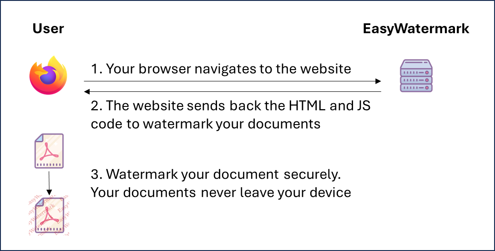
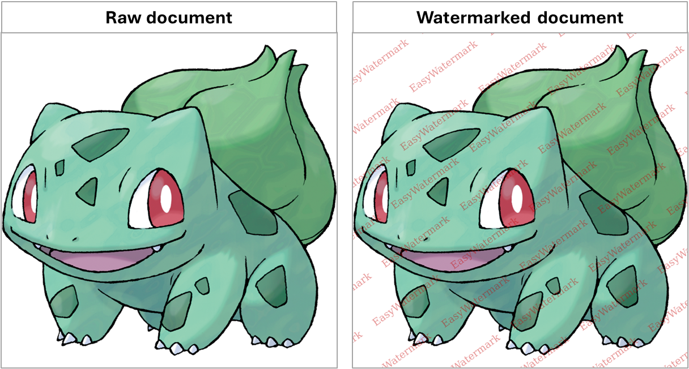

# EasyWatermark

A web service to watermark documents locally. Supports PDF, PNG and JPG files.

It is designed to add a layer of protection to identity documents against reuse.

Inspired by [FiligraneFacile](https://filigrane.beta.gouv.fr/), but unlike the latter, it does not upload your files to a remote server. 

## Architecture

Client-side web technologies only to provide privacy and compatibility.



The format of files stays the same during processing.

## Example



## Run

Tested on Node v20.19.2.

Clone the repository and run the following commands:

```sh
# Install packages
npm install

# Run locally
npx vite

# Run with Docker
. docker.sh
. test_docker.sh

```

## Credits

Build
- [Node](https://nodejs.org/)
- [Vite](https://vite.dev/)
- [Tailwind CSS](https://tailwindcss.com/)

Libraries
- [PDF.js](https://github.com/mozilla/pdf.js)
- [jsPDF](https://github.com/parallax/jsPDF)

Icons
- [icons8.com](https://icons8.com/)

## Ideas for improvement

- Internationalisation
- Hosted service and sponsor
- <input type="color"> is not fully supported on most browsers (value, alpha, colorspace)

## License

Released under [GNU General Public License version 2 only](LICENSE)

